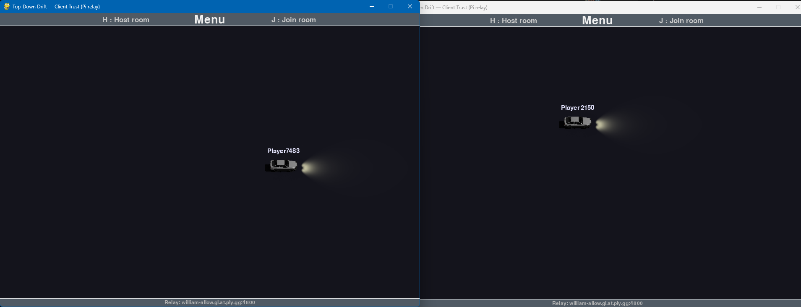
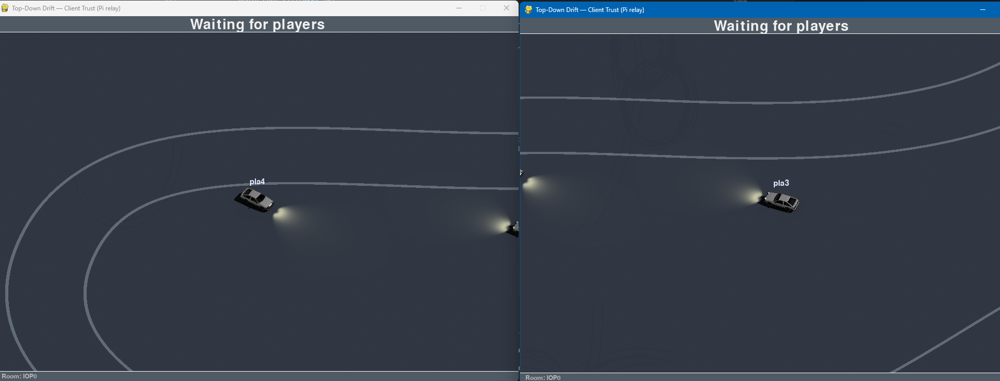

# Pygame Drift Car Racing — AI & Multiplayer

Top-down drift racing game built with **pygame-ce**, featuring:
- **Online multiplayer** (host or join via code; the host's PC acts as the server)
- **Advanced AI driving** (neural network-based AI, player auto-drive and AI opponents)
- **Multiple car models** (AE86, M5 with unique sound profiles)
- **Advanced audio system** (threaded engine RPM simulation, gear shifts, turbo sounds)
- **Track chunking** for very large maps (12k+ resolution support)
- **Camera zoom/pan** and quality-of-life settingse Drift Car Racing — AI & Multiplayer

Top-down drift racing game built with **pygame-ce**, featuring:
- **Online multiplayer** (host or join via code; the host’s PC acts as the server)
- **AI driving** (player auto-drive and AI opponents)
- **Track chunking** for very large maps
- **Camera zoom/pan** and quality-of-life settings

---

## Controls

### Car
- **Up / Z** — accelerate
- **Down / S** — reverse
- **Left / Q** — steer left
- **Right / D** — steer right
- **Space** — handbrake
- **Cursor-follow mode** — the car follows the mouse cursor *(enable in Settings)*
- **AI pathfinding mode** — the car drives itself using the AI pathfinder *(enable in Settings)*

> Note: Both **ZQSD** and **arrow keys** are supported.

### Lobby Menu
- **H** — host a new game
- **J** — join a game

### In-Game
- **Esc** — open Settings
- **N** — spawn an AI car

---

## Getting Started

### Requirements
- Python 3.11+ (3.12 tested)
- `pygame-ce` 2.5.x
- (Optional) Controller support enabled in-game

### Quick Run
- `pip install -e .` (once on your venv)
- `python -m drift`

### Multiplayer
- The player who hosts acts as the server (peer-hosted).
- The other player(s) join using the generated code.
- Tunneling via playit.gg is supported to reach hosts behind NAT.

---

## Features

### AI modes
- Player auto-drive via advanced pathfinding algorithm
- Neural network-based AI opponents with speed awareness
- Spawnable AI opponents (N) in both offline and multiplayer
### Drift system
- Drift detection, scoring objects, and tire marks that fade over time
### Large track support
- Image auto-slicing into tiles (slice_map.py)
- Chunked rendering and boundary collisions across tiles
- Support for 12k+ resolution track maps
### Camera
- Smooth zoom/dezoom and clamped panning via camera object
- Improved scaling methods for chunk mode
### Audio
- Threaded audio system for performance
- Engine RPM simulation with realistic sound blending
- Gear shift sounds and turbo effects
- Multiple sound profiles per car model
### UI
- Lobby + in-game settings, improved menus
- 64-rotation car sprites (car/shadow/headlights)
- Multiple car models with unique assets

---

## Changelog

### oct 12 2025
- clean : assets restructure

### oct 11 2025
- v0.7.5: car class update. 'C' to change car. ai car is random
- debug : fps ui at screen top right
- clean : fixed imports

### oct 09 2025
- v0.7.4 : audio thread update

### oct 07 2025
- v0.7.3 : added input soothing and fixed car physics
- clean : fixed pyinstaller

### oct 06 2025
- v0.7.2 : better sound system with new sfx
- v0.7.1 : threaded audio system for improved performance
- clean : update sources and remove dev files
- clean : add dependencies for pillow and numpy
- v0.7.0 : new audio system with turbo sound effects

### oct 03 2025
- v0.6.7 : added M5 car model and AI neural network model

### oct 02 2025
- v0.6.6 : cam system adjusted
- clean : entire project structure rework

### oct 01 2025
- patch : subsurface rect outside surf area -> fixed
- v0.6.5 : improved camera logic ; adjusted scaling method for chunk mode
- clean : better track managing
- debug : chunk system tested on a 12k track map
- v0.6.4 : slice_map.py to autoslice track map into tiles
- v0.6.3 : boundary collisions in chunk map system (v2)

### sep 30 2025
- v0.6.2 : new chunk map system (v1)
- v0.6.1 : new 64 rotations car assets (car, shadow, headlights)
- v0.5.15 settings update
- patch : settings -> fixed
- issue : settings ui and functionning
- clean : use of substage for settings instead of stage
- patch : ai cars wasnt being cleared after an error screen -> fixed
- v0.5.14 : better ai (account for speed)
- clean : split files
- v0.5.13 : collisions update ; car data visible in ai mode ; engine sound update
- v0.5.12 : new rpm drift system

### sep 29 2025
- v0.5.11 : new engine sound system
- v0.5.10 : rpm gauges and temporary sounds assets
- v0.5.9 : engine rpm (sound system)
- v0.5.8 : offline mode

### sep 28 2025
- clean : split main.py into multiple files
- v0.5.7 (patch) : detection getting stuck at the track map's end/start points -> fixed
- v0.5.6 (patch) : ai debug surface (red lines) -> fixed
- v0.5.5 : settings update
- v0.5.4 : ai cars now work in multiplayer
- v0.5.3 : ai mode in settings (player car can autodrive)
- v0.5.2 : drift points object (?) and 'N' to spawn ai cars
- v0.5.1 : new ai and path finding algorithm
- v0.4.2/3 : ui updates
- v0.4.1 : new drift detection system ; cursor follow mode ; better menu buttons
- patch : tire pos & duplicate lines -> fixed
- v0.3.11 : switch from pygame to pygame-ce
- patch : "leave room" button -> fixed
- patch : player username input -> fixed

### sep 27 2025
- patch : collision system -> fixed
- patch : camera clamp -> fixed
- patch : tire marks -> fixed
- issue : collision system temporary disabled 
- patch : view fix
- v0.3.10 : new track map and camera clamp fix
- clean : remove unused assets/ae86/image0031.png
- v0.3.9 : ui system rework
- v0.3.8 : new assets (car, shadow and headlights)
- v0.3.7 : headlights via pygame functions (todo: switch to images for perf)
- v0.3.6 : ui menu update
- patch : "leave room" button crashes the game -> fixed
- v0.3.5 : "leave room" button update
- clean : seperate functions
- v0.3.4 : button class ; quick settings upgrade needed to be adjusted
- clean : seperate files ; use of constants

### sep 26 2025
- patch : zoom clamp crash -> fixed
- v0.3.3 : camera object for zoom/dezoom
- v0.3.2 : controller support ; light physics upgrade
- v0.3.1 : ae86 prototype with 32 rotations
- patch : drift_ratio communication -> fixed
- v0.2.4 : tire marks that fade over time
- v0.2.3 : allow higher server tick for better performance and lower latency
- v0.2.2 : collisions upgrade
- debug : auto_run_game.py to launch 2 instances connecting to the same host
- patch : identations issue
- v0.2.1 : better server
- v0.1.5 : physic enhancement ; error handling
- v0.1.4 : Settings in menu ; in-game (Esc)
- clean : comments

### sep 25 2025
- v0.1.3 : better drift detection
- patch : collisions system broken -> fixed
- v0.1.2 : add of collisions system
- v0.1.1 : new physic, drift system enhancement
- v0.1.0 : pygame init

---

## Misc

### Known Issues
- Racing AI behavior (not full drift racing behavior)
- Performance optimization needed for large audio processing

### To-Do List
- Optimize threaded audio system performance
- Expand neural network AI training
- Add more car models (Dodge, etc.)
- Multiple track maps with different themes
- Customize keybinds interface
- Sound effect variety expansion

---

## Demo assets (🚧 update needed 🚧)

### v0.3

### v0.2

### v0.1

### v0.7
[Watch this video](https://www.youtube.com/watch?v=Qid3QSuOBOc)

## Sources

- https://samplefocus.com/samples/blow-off-valve-supra-stutututu
